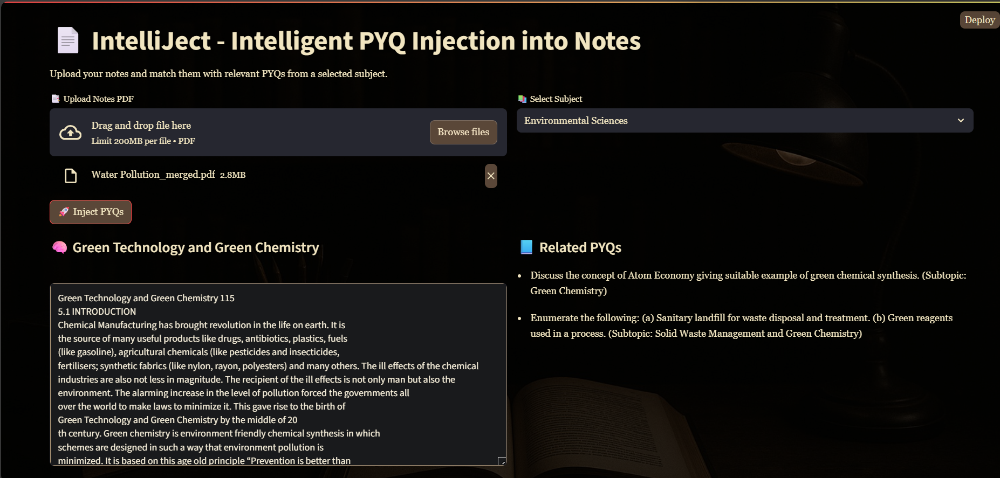

# IntelliJect - Intelligent PYQ Injection into Notes 📄🧠

  

IntelliJect is a GenAI-powered Streamlit app that enriches student notes by semantically injecting relevant Previous Year Questions (PYQs) based on inferred subtopics.

✨ Features

🧠 Smart Subtopic Detection (GPT-4o)  
Automatically identifies the most specific subtopic for each chunk of your notes using GPT-4o — no manual tagging needed.

🔍 Semantic Filtering with OpenAI Embeddings  
Matches PYQs based on **meaning**, not just keywords, using cosine similarity of subtopics.

📘 Diverse & Relevant Question Retrieval (FAISS + MMR)  
Leverages FAISS with Maximal Marginal Relevance to surface **diverse, high-quality** questions — no duplicates or noise.

🧹 Generic Question Removal  
Filters out common or overly repeated PYQs to keep results focused and unique.

🧾 PDF Parsing & Sentence Chunking  
Reads PDFs using LangChain loaders and splits them into logical sentence blocks for context-aware matching.

🎨 Aesthetic Streamlit UI  
Dual-pane dark mode layout, with custom fonts and background image — tailored for distraction-free studying.

## 🗂 Project Structure
intelliject-pyq-enhancer/
├── app/
│   ├── main.py                
│   └── subjects/              
├── assets/
│   └── background.jpg         
├── screenshot.png            
├── requirements.txt           
├── .env                       
├── .gitignore                 
└── README.md  
